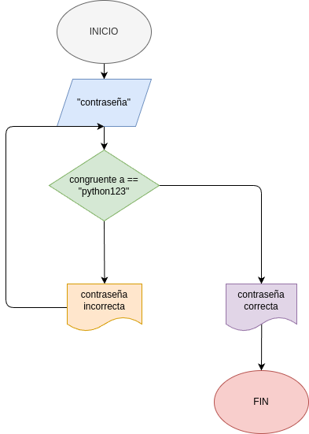

# Ejercicio No.1

Ejercicio No. 1:  El Validador de "Passwords" Situación: Estás creando una app y quieres que el usuario no pueda avanzar hasta que introduzca la clave correcta. Problema: Crea un programa que pida una contraseña. Si es incorrecta, debe decir "Error" y pedirla de nuevo. Si es "python123", debe decir "Acceso concedido"

## DISEÑO
